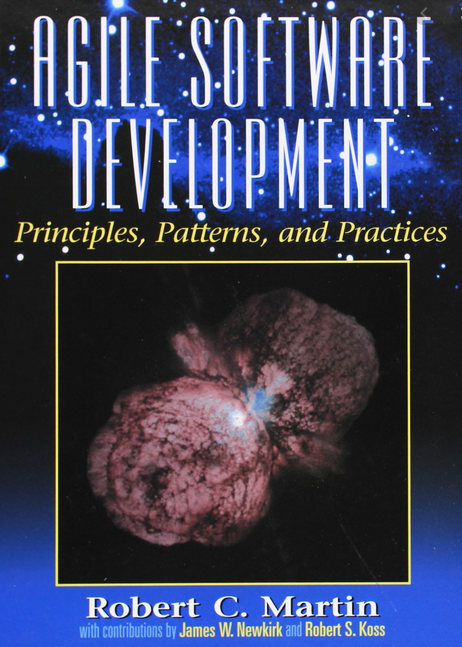
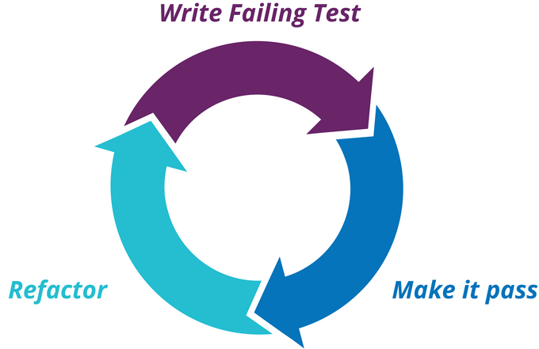
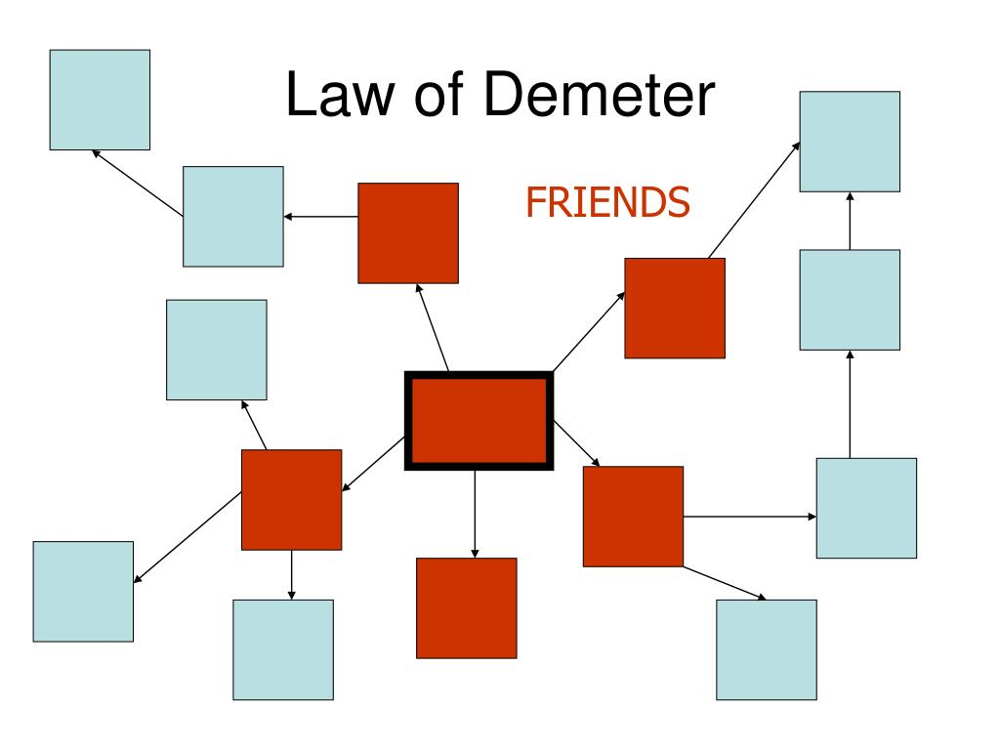
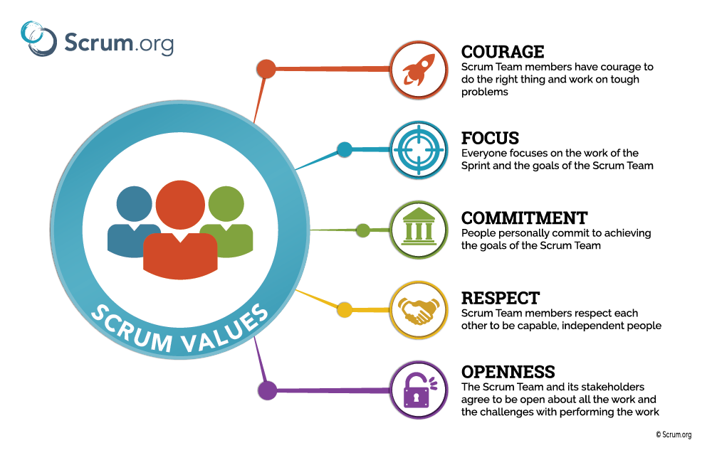

# Software development practices and principles

## The Twelve Factors

The [twelve-factor](resources/docs/12factor.md) methodology can be applied to apps written in any programming language, and which use any combination of backing services (database, queue, memory cache, etc).  

## Robert C. Martin's Design Principles and Design Patterns

Robert C. Martin collected [ten principles](resources/docs/uncle.md) dealing with object-oriented design. The first five of them—the so-called **SOLID** principles— deal with the design of classes.

SOLID is an acronym for the first five object-oriented design (OOD) principles by Robert C. Martin (also known as Uncle Bob).

These principles establish practices that lend to developing software with considerations for maintaining and extending as the project grows. Adopting these practices can also contribute to avoiding code smells, refactoring code, and Agile or Adaptive software development. 

The SOLID principles can also form a core philosophy for methodologies such as agile development or adaptive software development.    

## ACID

[ACID](resources/docs/ACID.md) is a set of properties of database transactions intended to guarantee data validity despite errors, power failures, and other mishaps.

## TDD

[Test-driven development (TDD)](resources/docs/TDD.md) is a software development process relying on software requirements being converted to test cases before software is fully developed, and tracking all software development by repeatedly testing the software against all test cases. American software engineer Kent Beck, who is credited with having developed or "rediscovered" the technique, stated in 2003 that TDD encourages simple designs and inspires confidence.

## Git Commit Formatting Rules

Why good commit messages matter? If you browse the log of any random Git repository, you will probably find its commit messages are more or less a mess. A well-crafted Git commit message is the best way to communicate context about a change to fellow developers (and indeed to their future selves). [Git Commit Formatting Rules](resources/docs/commit.md)

## Don't repeat yourself (DRY)

[DRY](resources/docs/DRY.md) is a principle of software development aimed at reducing repetition of software patterns, replacing it with abstractions or using data normalization to avoid redundancy. The DRY principle is stated as "Every piece of knowledge must have a single, unambiguous, authoritative representation within a system".

## Keep It Super Simple (KISS)

[KISS](resources/docs/KISS.md), an acronym for **Keep It Super Simple**, is a design principle noted by the U.S. Navy in 1960. The KISS principle states that most systems work best if they are kept simple rather than made complicated; therefore, simplicity should be a key goal in design, and unnecessary complexity should be avoided.  

## The Law of Demeter

[The Law of Demeter](resources/docs/LOD.md) or principle of least knowledge is a design guideline for developing software, particularly object-oriented programs.

In its general form, the LoD is a specific case of loose coupling. The guideline was proposed by Ian Holland at Northeastern University towards the end of 1987. It is so named for its origin in the Demeter Project, an adaptive programming and aspect-oriented programming effort.   

## SCRUM values

[Scrum](resources/docs/SCRUM.md) is a framework utilizing an agile mindset for developing, delivering, and sustaining complex products. 

Scrum is a feedback-driven empirical approach which is, like all empirical process control, underpinned by the three pillars of transparency, inspection, and adaptation. 

All work within the Scrum framework should be visible to those responsible for the outcome: the process, the workflow, progress, etc. 

In order to make these things visible, scrum teams need to frequently inspect the product being developed and how well the team is working. With frequent inspection, the team can spot when their work deviates outside of acceptable limits and adapt their process or the product under development.

## Principles of Software Engineering - University of Minnesota

[Principles of Software Engineering](resources/docs/umn.md) by University of Minnesota.

