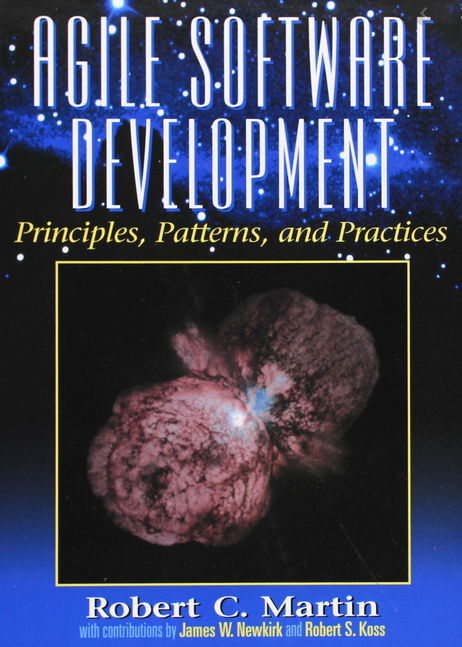

# Design Principles and Design Patterns
**By Robert C. Martin**

From [Universitat Automoma de Barcelona](http://www.cvc.uab.es/shared/teach/a21291/temes/object_oriented_design/materials_adicionals/principles_and_patterns.pdf), [digitalocean](https://www.digitalocean.com/community/conceptual_articles/s-o-l-i-d-the-first-five-principles-of-object-oriented-design), [Principles Wiki](http://principles-wiki.net/collections:robert_c._martin_s_principle_collection)

Robert C. Martin collected ten principles dealing with object-oriented design. The first five of them—the so-called **SOLID** principles— deal with the design of classes.

**SOLID** is an acronym for the first five object-oriented design (OOD) principles by Robert C. Martin (also known as Uncle Bob).

These principles establish practices that lend to developing software with considerations for maintaining and extending as the project grows. Adopting these practices can also contribute to avoiding code smells, refactoring code, and Agile or Adaptive software development. 

The **SOLID** principles can also form a core philosophy for methodologies such as agile development or adaptive software development.     

## SOLID

* **S** - Single-responsiblity Principle

* **O** - The Open Closed Principle (OCP): A module should be open for extension but closed for modification.

* **L** - The Liskov Substitution Principle (LSP): Subclasses should be substitutable for their base classes.

* **I** - The Interface Segregation Principle (ISP): Many client specific interfaces are better than one general purpose interface.

* **D**  - The Dependency Inversion Principle (DIP): Depend upon Abstractions. Do not depend upon concretions.

## Package cohesion principles

* Release-Reuse Equivalency Principle (REP)

* Common Closure Principle (CCP)

* Common Reuse Principle (CRP)

## Package coupling principles

* Acyclic Dependency Principle (ADP)

* Stable Dependencies Principle (SDP)

* Stable Abstractions Principle (SAP)

